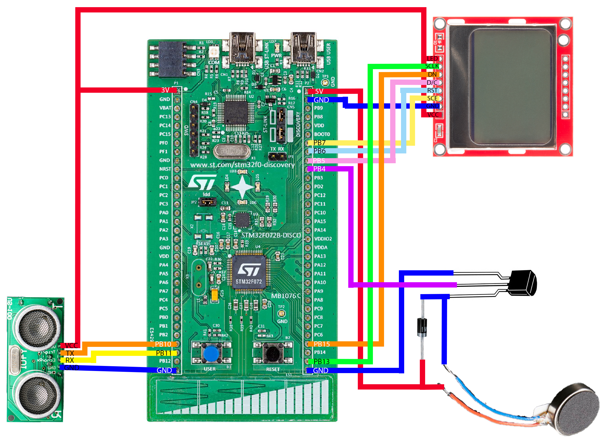
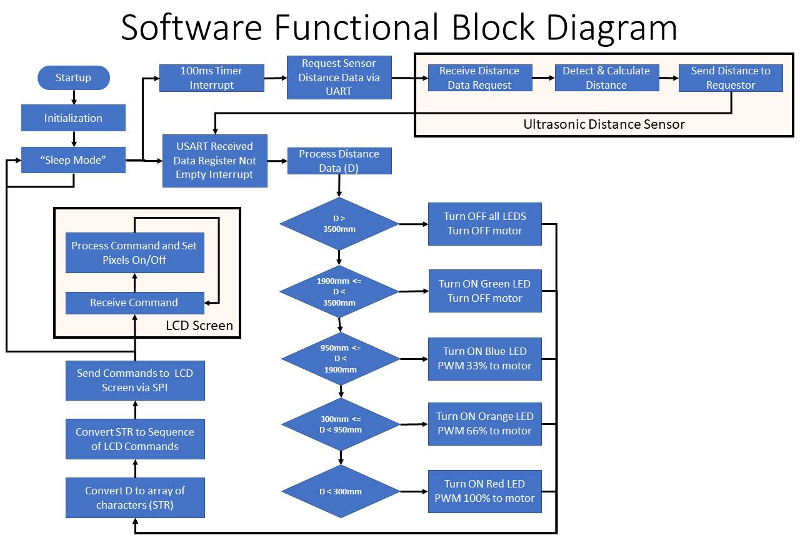

# Collision Sensor

## Purpose

The Collision Sensor utilizes an ultrasonic distance sensor to measure the distance to objects in its path and warn the user when objects are getting close. The warnings come in the form of LED lights that indicate how close the object is, a vibration motor that increases motor vibration intensity as objects get closer, and an LCD screen that prints the measured distance. The temperature is also printed on the LCD display in both Fahrenheit and Celsius.

## Parts List

- MCU: [STM32f072BDISCOVERY](https://www.st.com/en/evaluation-tools/32f072bdiscovery.html)
- Ultrasonic Distance Sensor: [US-100](https://www.adafruit.com/product/4019)
- Vibration Motor: [Motor Disc](https://www.adafruit.com/product/1201)
- LCD: [Nokia 5110](https://www.sparkfun.com/products/10168)
- Transistor: [PN2222](https://www.digikey.com/product-detail/en/on-semiconductor/PN2222ATA/PN2222ATACT-ND/3042489)
- Diode: [1N4001](https://www.digikey.com/product-detail/en/comchip-technology/1N4001-G/641-1310-1-ND/1979675)

## Software List

- Software Development Kit: [Keil µVision 5](https://www2.keil.com/mdk5)

## Functionality

### Overview

The collision sensor utilizes a hybrid between polling and interrupt driven software architecture. A timer interrupt occurs every 100ms, at which point a command (0x55) is sent to the ultrasonic distance sensor via UART that initiates a distance measurement. Once the command is sent, the main thread goes into a waiting loop until the a new distance value is available. The ultrasonic distance sensor takes about 50ms to obtain a 16 bit distance reading, which it will send to the MCU over UART in two 8 bit messages. When a UART message is received, an interrupt request is generated and the data is processed. Once the 16 bit distance measurement is reassembled by the MCU, a variable is set which alerts the main thread that a distance is available. That distance measurement is then used to do three things:

1. The LEDs are turned off and on according to the thresholds described below.
2. The motor vibration intensity is set using pulse width modulation according to the thresholds described below.
3. The distance is printed on the LCD screen according to the process described below.

Once the distance warnings are set and the measurement is printed, a temperature measurement is requested from the US-100 which is printed to the LCD screen underneath the distance measurement.

### Thresholds

The thresholds and corresponding LEDs and PWM duty cycles are:

- distance \> 3500 mm (~ 12 ft.): No LEDs on, 0% duty cycle
- 1900 mm (~ 6 ft.) >= distance < 3500 mm (~12 ft.): Green LED on, 0% duty cycle
- 950 mm (~ 3 ft.) >= distance < 1900 mm (~ 6 ft.): Blue LED on, 33% duty cycle
- 300 mm (~ 1 ft.) >= distance < 950 mm (~ 3 ft.): Orange LED on, 66% duty cycle
- distance < 300 mm (~ 1 ft.): Red LED on, 100% duty cycle

Note: Only the specified LED is on within each threshold, all other LEDs are off.

### Printing to LCD

To print the distance to the Nokia 5110 LCD screen, the distance integer is first converted to an array of characters representing each digit. These characters are then converted to arrays of hexadecimal which represent which pixels of the LCD screen to turn on and which to turn off. Each column of a row of the LCD screen is made up of 8 pixels whose status is controlled by one byte. A 1 means the pixel will be on while a 0 means it will be off. For example, an 'A' is represented by the array { 0xF8, 0x24, 0x22, 0x24, 0xF8 } and will look like:

 Each character takes up 5 columns of 8 pixels. The hexadecimal arrays are sent one byte at a time to the LCD screen over SPI. More information on how to print to the LCD screen can be found in it's [datasheet](https://www.sparkfun.com/datasheets/LCD/Monochrome/Nokia5110.pdf).

## Setup Instructions

The wiring diagram is as follows:

### Power supplies

The US-100 Ultrasonic Distance Sensor and the Nokia 5110 LCD screen should be connected to 3V while the vibration motor should be connected to 5V, although 3V can be used to produce lower vibration intensity.

An optional potentiometer can be inserted between the 3V line and the Nokia 5110 LCD screen's LED pin to control the backlight level.

A transistor is utilized to control the vibration motor with a lower current from the PWM pin PB4. A diode is placed in between the transistor and motor in order to prevent back voltage.

### US-100 Ultrasonic Distance Sensor Pin Connections

Connections from the US-100 to the STM32f072 and the pin's mode if applicable:

- VCC <-> 3V
- GND <-> GND
- TX <-> PB10 (USART3 TX)
- RX <-> PB11 (USART3 RX)

Note: The US-100 UART pins are labelled according to which MCU pins connect to them.

### Vibration Motor Pin Connections

Connections from the STM32f072 to the transistor, diode, and vibration motor:

- GND <-> Transistor Emitter
- PB4 (PWM) <-> Transistor Collector
- 5V <-> Vibrating Motor VCC <-> Diode Cathode
- Diode Anode <-> Transistor Base <-> Vibrating Motor GND

### Nokia 5110 LCD Screen Pin Connections

Connections from the Nokia 5110 to the STM32f072 and the pin's mode if applicable:

- LED <-> 3V (a potentiometer can be placed in between to control LED backlight level)
- SCLK <-> PB13 (SPI2 SCLK)
- DN(MOSI) <-> PB15 (SPI2 MOSI)
- D/C <-> PB5 (General Purpose Output)
- RST <-> PB6 (General Purpose Output)
- SCE <-> PB7 (General Purpose Output)
- GND <-> GND
- VCC <-> 3V

### STM32f072 Internal Pin Connections

Connections from the STM32f072 to the internal LEDs:

- PC6 (General Purpose Output) <-> Red LED
- PC7 (General Purpose Output) <-> Blue LED
- PC8 (General Purpose Output) <-> Orange LED
- PC9 (General Purpose Output) <-> Green LED

### Programming the STM32f072

After making all the connections between the STM32f072 and the external parts, the next thing to do is program the MCU. First, download the code archive into a known place an unzip it. Second, download and install [Keil µVision 5](https://www2.keil.com/mdk5) which makes programing the board very simple. Once installed, open it and select the menu item Project->Open Project... This will open a file explorer window. Navigate to where you downloaded the code archive to and go to the folder [CollisionSensor/MDK-ARM](CollisionSensor/MDK-ARM) and select the Keil µVision 5 project file called [CollisionSensor.uvprojx](CollisionSensor/MDK-ARM/CollisionSensor.uvprojx). This will open the Collision Sensor project. Next, you want to build the project by selecting Project->Rebuild all target files. As long as the build produced zero errors, the project is ready to be loaded onto the STM32f072. Plug the board into your computer then select Flash->Download. If this succeeded, your board now has the project loaded on it and all you have to do is press the RESET button on the board. This will start the Collision Sensor Program.

## Software Flow and Organization

### Software Flow Block Diagram

*Note: Diagram does not include the Temperature measurement portion yet.*
The general flow of the software is described by the functional block diagram:

### Organization

The software is organized into 7 files located in ./CollisionSensor/Src:

- [main.c](CollisionSensor/Src/main.c) contains the pin definitions, warning threshold definitions, initialization, TIM2 (100 ms timer) interrupt handler, warning setter, and LED controller.
- [ultrasonicSensorUart.c](CollisionSensor/Src/ultrasonicSensorUart.c) and [ultrasonicSensorUart.h](CollisionSensor/Src/ultrasonicSensorUart.h) contain all functions pertaining to communication with the US-100 Ultrasonic Distance Sensor via UART.
- [motor.c](CollisionSensor/Src/motor.c) and [motor.h](CollisionSensor/Src/motor.h) contain all functions pertaining to manipulation of the motor controller. The motor vibration is controlled using PWM.
- [lcd.c](CollisionSensor/Src/lcd.c) and [lcd.h](CollisionSensor/Src/lcd.h) contain all functions pertaining to communicating with the Nokia 5110 LCD screen via SPI.
